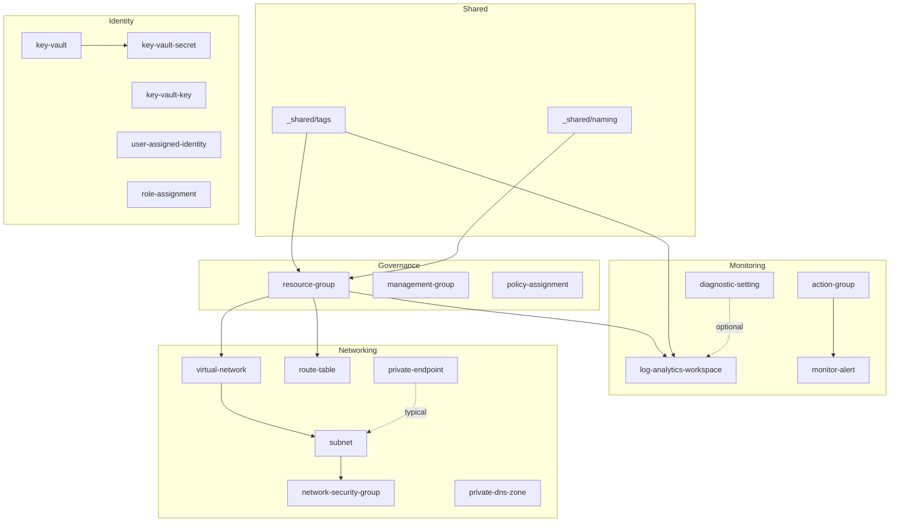

# Terraform Azure modules

Enterprise Terraform module library for Azure: CAF-style naming, policy-aligned tags, `azurerm` `~> 4.0`, Terraform `>= 1.9.0`. Modules are consumed from Azure DevOps Git using monorepo tags, for example:

```hcl
module "tags" {
  source = "git::https://dev.azure.com/{org}/{project}/_git/terraform-azure-modules//modules/_shared/tags?ref=v0.1.0"
}
```

## Module index

| Status | Path | Description |
|--------|------|-------------|
| **Implemented** | `modules/_shared/tags` | Mandatory tag validation and outputs |
| **Implemented** | `modules/_shared/naming` | CAF-style names and truncation |
| **Implemented** | `modules/governance/resource-group` | Resource group |
| **Implemented** | `modules/governance/management-group` | Management group hierarchy |
| **Implemented** | `modules/governance/policy-assignment` | Resource group policy assignment |
| **Implemented** | `modules/monitoring/log-analytics-workspace` | Log Analytics workspace |
| **Implemented** | `modules/monitoring/diagnostic-setting` | Diagnostic settings wrapper |
| **Implemented** | `modules/monitoring/action-group` | Monitor action group |
| **Implemented** | `modules/monitoring/monitor-alert` | Metric alert |
| **Implemented** | `modules/identity-security/key-vault` | Key Vault (RBAC by default) |
| **Implemented** | `modules/identity-security/key-vault-secret` | Key Vault secret |
| **Implemented** | `modules/identity-security/key-vault-key` | Key Vault key |
| **Implemented** | `modules/identity-security/user-assigned-identity` | User-assigned managed identity |
| **Implemented** | `modules/identity-security/role-assignment` | Azure RBAC role assignment |
| **Implemented** | `modules/networking/virtual-network` | Virtual network |
| **Implemented** | `modules/networking/subnet` | Subnet |
| **Implemented** | `modules/networking/network-security-group` | NSG with inline rules |
| **Implemented** | `modules/networking/route-table` | Route table with UDRs |
| **Implemented** | `modules/networking/private-endpoint` | Private endpoint |
| **Implemented** | `modules/networking/private-dns-zone` | Private DNS zone |
| **Implemented** | `modules/storage/storage-account` | Storage account |
| **Implemented** | `modules/storage/file-share` | Azure Files share |
| **Implemented** | `modules/database/mssql-server` | Azure SQL server |
| **Implemented** | `modules/database/mssql-database` | Azure SQL database |
| **Implemented** | `modules/database/postgresql-flexible-server` | PostgreSQL flexible server |
| **Implemented** | `modules/database/cosmosdb` | Cosmos DB account |
| **Implemented** | `modules/compute/virtual-machine` | Linux VM + NIC |
| **Implemented** | `modules/compute/virtual-machine-scale-set` | Linux VMSS |
| **Implemented** | `modules/compute/azure-virtual-desktop` | AVD host pool |
| **Implemented** | `modules/app-services/app-service-plan` | App Service plan (`azurerm_service_plan`) |
| **Implemented** | `modules/app-services/linux-web-app` | Linux Web App |
| **Implemented** | `modules/app-services/windows-web-app` | Windows Web App |
| **Implemented** | `modules/app-services/function-app` | Linux function app |
| **Implemented** | `modules/containers/container-registry` | Azure Container Registry |
| **Implemented** | `modules/containers/aks-cluster` | AKS |
| **Implemented** | `modules/containers/container-app-environment` | Container Apps environment |
| **Implemented** | `modules/containers/container-app` | Container app |
| **Implemented** | `modules/containers/container-app-job` | Container app job |

Each module’s `docs/README.md` follows a standard layout (overview, Mermaid, usage, variables, outputs, policy, naming where relevant, versioning, limitations).

## Examples

| Example | Status |
|---------|--------|
| `examples/single-resource` | **Ready** — tags, naming, resource group |
| `examples/complete-landing-zone` | **Started** — RG, Log Analytics, VNet, subnet, NSG, association, diagnostics |
| `examples/aks-workload` | Placeholder README only |
| `examples/web-app-with-db` | Placeholder README only |

Backend configuration belongs in **examples** (see commented `backend.tf` stubs), not in reusable modules.

## Validation

**IDE (HashiCorp Terraform extension):** If you open the parent repo (`IaC-Modules`) as the workspace root, IntelliSense may show false errors on `module` blocks (for example “Unexpected attribute”) because the language server does not always resolve local `module` sources until it has indexed the right roots. For accurate diagnostics, open **`terraform-azure-modules/terraform-azure-modules.code-workspace`** (File → Open Workspace from File), or open the **`terraform-azure-modules`** folder as the workspace root. `terraform validate` in each example remains the source of truth.

From `terraform-azure-modules/`:

```bash
terraform fmt -recursive -check
terraform fmt -recursive
```

Per module or example (after `terraform init -backend=false`):

```bash
terraform validate
```

For examples that require `subscription_id` (azurerm v4):

```powershell
$env:TF_VAR_subscription_id = "<subscription-guid>"
terraform validate
```

Install [TFLint](https://github.com/terraform-linters/tflint) and [tfsec](https://github.com/aquasecurity/tfsec) locally, then run `tflint --init`, `tflint`, and `tfsec .` as needed. [pre-commit](https://pre-commit.com/) hooks are defined in `.pre-commit-config.yaml`.

## Module dependency graph (overview)



Solid lines reflect common dependencies; many modules optionally send diagnostics to Log Analytics.

## Policies

Platform policies assumed:

1. **Required tags** on resource groups — enforced by using `_shared/tags` and passing `tags` into modules.
2. **Inherit tags from resource group** — resource modules use `lifecycle { ignore_changes = [tags] }` except the resource group module.
3. **UK South only** — `location` defaults to and validates `uksouth` where applicable.

## Licence / ownership

Internal organisational use — align with your Azure DevOps and governance standards.
