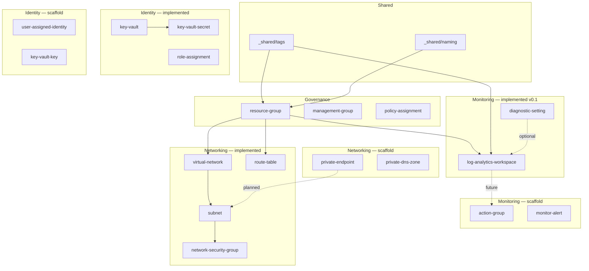

# Terraform Azure modules

Enterprise Terraform module library for Azure: CAF-style naming, policy-aligned tags, `azurerm` `~> 4.0`, Terraform `>= 1.9.0`. Modules are consumed from Azure DevOps Git using monorepo tags, for example:

```hcl
module "tags" {
  source = "git::https://dev.azure.com/{org}/{project}/_git/terraform-azure-modules//modules/_shared/tags?ref=v0.1.0"
}
```

## Module index

| Status | Path | Description |
|--------|------|-------------|
| **Implemented** | `modules/_shared/tags` | Mandatory tag validation and outputs |
| **Implemented** | `modules/_shared/naming` | CAF-style names and truncation |
| **Implemented** | `modules/governance/resource-group` | Resource group |
| **Implemented** | `modules/monitoring/log-analytics-workspace` | Log Analytics workspace |
| **Implemented** | `modules/monitoring/diagnostic-setting` | Diagnostic settings wrapper |
| **Implemented** | `modules/identity-security/key-vault` | Key Vault (RBAC by default) |
| **Implemented** | `modules/identity-security/key-vault-secret` | Key Vault secret |
| **Implemented** | `modules/identity-security/role-assignment` | Azure RBAC role assignment |
| **Implemented** | `modules/networking/virtual-network` | Virtual network |
| **Implemented** | `modules/networking/subnet` | Subnet |
| **Implemented** | `modules/networking/network-security-group` | NSG with inline rules |
| **Implemented** | `modules/networking/route-table` | Route table with UDRs |
| Scaffold | `modules/governance/management-group` | Planned |
| Scaffold | `modules/governance/policy-assignment` | Planned |
| Scaffold | `modules/networking/private-endpoint`, `private-dns-zone` | Planned |
| Scaffold | `modules/compute/*` | Planned |
| Scaffold | `modules/storage/*` | Planned |
| Scaffold | `modules/database/*` | Planned |
| Scaffold | `modules/identity-security/key-vault-key`, `user-assigned-identity` | Planned |
| Scaffold | `modules/monitoring/action-group`, `monitor-alert` | Planned |
| Scaffold | `modules/app-services/*` | Planned |
| Scaffold | `modules/containers/*` | Planned |

Each module’s `docs/README.md` follows a standard layout (overview, Mermaid, usage, variables, outputs, policy, naming, versioning, limitations).

## Examples

| Example | Status |
|---------|--------|
| `examples/single-resource` | **Ready** — tags, naming, resource group |
| `examples/complete-landing-zone` | **Started** — RG, Log Analytics, VNet, subnet, NSG, association, diagnostics |
| `examples/aks-workload` | Placeholder README only |
| `examples/web-app-with-db` | Placeholder README only |

Backend configuration belongs in **examples** (see commented `backend.tf` stubs), not in reusable modules.

## Validation

From `terraform-azure-modules/`:

```bash
terraform fmt -recursive -check
terraform fmt -recursive
```

Per module or example (after `terraform init -backend=false`):

```bash
terraform validate
```

For examples that require `subscription_id` (azurerm v4):

```powershell
$env:TF_VAR_subscription_id = "<subscription-guid>"
terraform validate
```

Install [TFLint](https://github.com/terraform-linters/tflint) and [tfsec](https://github.com/aquasecurity/tfsec) locally, then run `tflint --init`, `tflint`, and `tfsec .` as needed. [pre-commit](https://pre-commit.com/) hooks are defined in `.pre-commit-config.yaml`.

## Module dependency graph (v0.1 + roadmap)



Solid lines reflect **implemented** modules and the `complete-landing-zone` example; dashed lines are **planned** links.

## Policies

Platform policies assumed:

1. **Required tags** on resource groups — enforced by using `_shared/tags` and passing `tags` into modules.
2. **Inherit tags from resource group** — resource modules use `lifecycle { ignore_changes = [tags] }` except the resource group module.
3. **UK South only** — `location` defaults to and validates `uksouth` where applicable.

## Licence / ownership

Internal organisational use — align with your Azure DevOps and governance standards.
