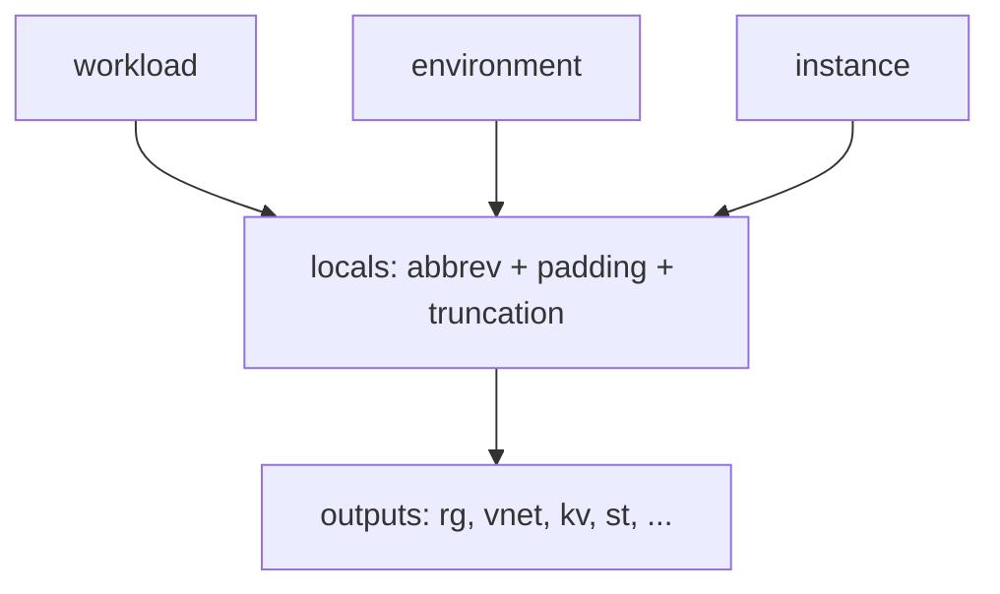

# Shared naming (CAF-style)

> Produces consistent, length-aware Azure resource names from workload, environment, and instance index for use with organisational CAF patterns.

## Overview

Call this module alongside `_shared/tags` at stack level. It does **not** create resources; it outputs strings only. Globally unique names (Key Vault, storage account, ACR) apply deterministic truncation — shortening the `workload` segment first — so the same inputs always yield the same name. Regional names use a hyphenated `{workload}-{environment_abbrev}-{instance}` pattern.

## Architecture diagram



## Prerequisites

- Terraform `>= 1.9.0`
- `environment` must match the same logical values as `_shared/tags`

## Usage

### Minimal example

```hcl
module "naming" {
  source = "./modules/_shared/naming"

  workload    = "myapp"
  environment = "Development"
}
```

### Production example

```hcl
module "naming" {
  source = "./modules/_shared/naming"

  workload    = "payments"
  environment = "Production"
  location    = "uksouth"
  instance    = 2
}

resource "azurerm_resource_group" "example" {
  name     = module.naming.resource_group
  location = "uksouth"
}
```

### Calling from ADO

```hcl
module "naming" {
  source = "git::https://dev.azure.com/{org}/{project}/_git/terraform-azure-modules//modules/_shared/naming?ref=v0.1.0"

  workload    = var.workload
  environment = var.environment
}
```

## Input variables

| Name | Type | Default | Required | Description |
|------|------|---------|----------|-------------|
| workload | string | — | yes | 1–12 chars: lowercase letters, digits, hyphens. |
| environment | string | — | yes | Same allowed values as the tags module. |
| location | string | uksouth | no | Must remain `uksouth` (Azure Policy). |
| instance | number | 1 | no | Suffix as three digits (001, 002, …). |

## Outputs

| Name | Description |
|------|-------------|
| resource_group | `rg-{workload}-{env}-{instance}` |
| virtual_network | `vnet-{workload}-{env}-{instance}` |
| subnet | `snet-{workload}-{env}-{instance}` |
| nsg | `nsg-{workload}-{env}-{instance}` |
| key_vault | `kv-…` max 24 chars; **globally unique** |
| storage_account | `st…` max 24; lowercase alphanumeric; **globally unique** |
| log_analytics | `log-{workload}-{env}-{instance}` |
| app_service_plan | `asp-{workload}-{env}-{instance}` |
| linux_web_app | `app-{workload}-{env}-{instance}` |
| windows_web_app | `wapp-{workload}-{env}-{instance}` |
| function_app | `func-{workload}-{env}-{instance}` |
| container_registry | `cr…` max 50; alphanumeric; **globally unique** |
| aks_cluster | `aks-{workload}-{env}-{instance}` |
| container_app_env | `cae-{workload}-{env}-{instance}` |
| container_app | `ca-{workload}-{env}-{instance}` |
| container_app_job | `caj-{workload}-{env}-{instance}` |
| virtual_machine | `vm-…` max **15** chars total (Windows hostname); workload truncated |
| mssql_server | `sql-{workload}-{env}-{instance}` |
| postgresql_server | `psql-{workload}-{env}-{instance}` |
| cosmosdb | `cosmos-{workload}-{env}-{instance}` |
| user_assigned_identity | `id-{workload}-{env}-{instance}` |
| action_group | `ag-{workload}-{env}-{instance}` |
| route_table | `rt-{workload}-{env}-{instance}` |
| private_endpoint | `pe-{workload}-{env}-{instance}` |
| private_dns_zone | `pdns-{workload}-{env}-{instance}` |
| application_gateway | `agw-{workload}-{env}-{instance}` |
| public_ip | `pip-{workload}-{env}-{instance}` |

## Policy compliance

- **UK South:** `location` must be `uksouth`, matching regional deployment policy for workloads using these names in UK South.
- **Required tags / inherit tags:** Naming only; tags are handled by `_shared/tags` and resource modules.

## Resource naming

Hyphenated patterns use environment abbreviations: Production→`prod`, Staging→`stg`, Test→`tst`, Development→`dev`, Disaster Recovery→`dr`. Storage and ACR strip hyphens from `workload` and enforce maximum lengths; Key Vault truncates `workload` to satisfy the 24-character limit.

## Versioning

Monorepo semver tags (`vMAJOR.MINOR.PATCH`). Breaking changes to output strings or truncation rules require a **major** bump.

## Known limitations

- Global names may still collide in rare cases; resolve by changing `workload` or `instance`.
- Windows VM/computer name output max 15 characters may require a very short effective workload segment for long environment abbreviations.
