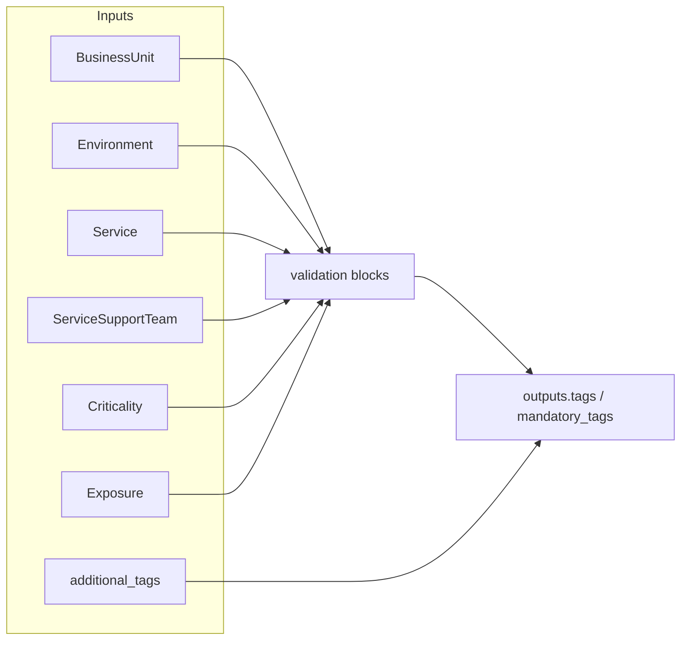

# Shared tags (policy-aligned)

> Validates the six mandatory organisational tags and optional additional tags against the same allowed values as Azure Policy, outputting a map ready for resource groups and resources.

## Overview

This module is the **single place** to update when Azure Policy allowed values change for `BusinessUnit`, `Environment`, `Service`, `ServiceSupportTeam`, `Criticality`, and `Exposure`. Every consuming module expects `var.tags` to come from this module (or an equivalent validated map). The output keys match Azure Policy tag names exactly. Additional tags can be merged for scenarios that do not conflict with policy.

Teams should call this module once per root module or stack, then pass `module.tags.tags` into domain modules. Keeping validation here avoids duplicated lists and drift between Terraform and Policy.

## Architecture diagram



## Prerequisites

- Terraform `>= 1.9.0` (validation blocks reference `local` values)
- No Azure permissions required (no resources created)

## Usage

### Minimal example

```hcl
module "tags" {
  source = "./modules/_shared/tags"

  business_unit        = "IT"
  environment          = "Development"
  service                = "Monitoring"
  service_support_team   = "IT"
  criticality            = "Important"
  exposure               = "Internal"
}

output "tags" {
  value = module.tags.tags
}
```

### Production example

```hcl
module "tags" {
  source = "./modules/_shared/tags"

  business_unit        = "IT"
  environment          = "Production"
  service                = "SIEM"
  service_support_team   = "IT"
  criticality            = "Critical"
  exposure               = "Internal"

  additional_tags = {
    CostCenter = "12345"
  }
}
```

### Calling from an ADO pipeline

```hcl
module "tags" {
  source = "git::https://dev.azure.com/{org}/{project}/_git/terraform-azure-modules//modules/_shared/tags?ref=v0.1.0"

  business_unit        = var.business_unit
  environment          = var.environment
  service                = var.service
  service_support_team   = var.service_support_team
  criticality            = var.criticality
  exposure               = var.exposure
}
```

## Input variables

| Name | Type | Default | Required | Description |
|------|------|---------|----------|-------------|
| business_unit | string | — | yes | Allowed `BusinessUnit` value (see validation error message for list). |
| environment | string | — | yes | Allowed `Environment` value. |
| service | string | — | yes | Allowed `Service` value. |
| service_support_team | string | — | yes | Allowed `ServiceSupportTeam` value. |
| criticality | string | — | yes | Allowed `Criticality` value. |
| exposure | string | — | yes | Allowed `Exposure` value. |
| additional_tags | map(string) | {} | no | Extra tags merged after mandatory tags. |

## Outputs

| Name | Type | Description |
|------|------|-------------|
| mandatory_tags | map(string) | Map of the six mandatory tags only. |
| tags | map(string) | Mandatory tags merged with `additional_tags`. |

## Policy compliance

- **Required tags (RG):** All six values are validated against Policy allowed lists before any resource is created.
- **Inherit tags from RG:** Not applicable at this layer; downstream modules may use `lifecycle { ignore_changes = [tags] }` on resources.
- **UK South:** Not applicable (no region in this module).

## Resource naming

N/A — this module does not construct Azure resource names.

## Versioning

Git tags on the monorepo follow `vMAJOR.MINOR.PATCH`. Bump **patch** for allowed-list corrections and docs; **minor** for backward-compatible additions (e.g. new optional outputs); **major** for renames or breaking type changes.

## Known limitations

- Allowed values are maintained manually to mirror Policy; if Policy updates without updating this module, Terraform may plan successfully while deployment is denied at Azure.
