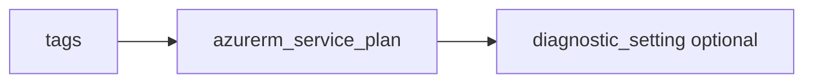

# App Service plan

> Deploys `azurerm_service_plan` (current provider resource for App Service / Functions plans) with optional diagnostics.

## Overview

Choose `os_type` (`Linux` or `Windows`) and `sku_name` for your workload. The plan is referenced by web apps and function apps via `service_plan_id` outputs from those modules.

## Architecture diagram



## Usage

```hcl
module "plan" {
  source = "../../modules/app-services/app-service-plan"

  resource_group_name = module.rg.name
  location            = "uksouth"
  tags                = module.tags.tags
  name                = "plan-linux-01"
  os_type             = "Linux"
  sku_name            = "P1v3"
}
```

## Input variables

| Name | Type | Default | Required | Description |
|------|------|---------|----------|-------------|
| resource_group_name | string | — | yes | Resource group name |
| location | string | uksouth | no | Must be `uksouth` |
| tags | map(string) | — | yes | `_shared/tags` output |
| name | string | — | yes | Plan name |
| os_type | string | Linux | no | Linux or Windows |
| sku_name | string | — | yes | SKU |
| diagnostics_settings | object | null | no | Diagnostics to LAW |

## Outputs

| Name | Type | Description |
|------|------|-------------|
| id | string | Plan resource ID |
| name | string | Plan name |
| service_plan | object | Resource object |

## Policy compliance

- **Tags / location:** `uksouth` validation; `lifecycle { ignore_changes = [tags] }`.

## Versioning

Monorepo semver tags.

## Known limitations

- Zone redundancy and per-zone settings are not exposed in this minimal module.
