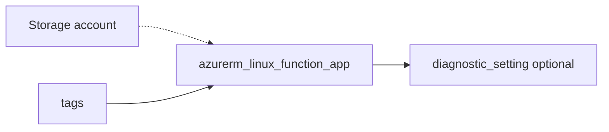

# Linux function app

> Deploys `azurerm_linux_function_app` with `storage_account_name` and `storage_account_access_key` for `AzureWebJobsStorage`, HTTPS default, and optional diagnostics.

## Overview

Point `service_plan_id` at a Functions-compatible plan. Supply storage account name and primary key from your `storage-account` module outputs. Treat the access key as sensitive.

## Architecture diagram



## Usage

```hcl
module "func" {
  source = "../../modules/app-services/function-app"

  resource_group_name        = module.rg.name
  location                   = "uksouth"
  tags                       = module.tags.tags
  name                       = "func-${module.naming.unique_suffix}"
  service_plan_id            = module.plan.id
  storage_account_name       = module.sa.name
  # Primary key is sensitive — supply from a data source, Key Vault, or pipeline variable.
  storage_account_access_key = data.azurerm_storage_account.fn.primary_access_key
}
```

## Input variables

| Name | Type | Default | Required | Description |
|------|------|---------|----------|-------------|
| resource_group_name | string | — | yes | Resource group name |
| location | string | uksouth | no | Must be `uksouth` |
| tags | map(string) | — | yes | `_shared/tags` output |
| name | string | — | yes | Function app name |
| service_plan_id | string | — | yes | App Service plan ID |
| storage_account_name | string | — | yes | Storage account name |
| storage_account_access_key | string | — | yes | Storage key (sensitive) |
| https_only | bool | true | no | HTTPS only |
| diagnostics_settings | object | null | no | Diagnostics to LAW |

## Outputs

| Name | Type | Description |
|------|------|-------------|
| id | string | Function app ID |
| name | string | App name |
| default_hostname | string | Default hostname |
| function_app | object | Resource object |

## Policy compliance

- **Tags / location:** `uksouth` validation; `lifecycle { ignore_changes = [tags] }`.

## Versioning

Monorepo semver tags.

## Known limitations

- Durable Functions storage and VNet integration require additional app settings.
