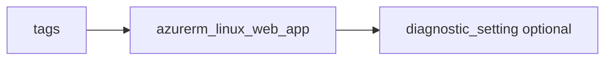

# Linux Web App

> Deploys `azurerm_linux_web_app` with minimal `site_config`, HTTPS default, and optional diagnostics.

## Overview

Pass `service_plan_id` from the `app-service-plan` module (`os_type = Linux`). `name` must be globally unique. Enable `https_only` by default for transport security.

## Architecture diagram



## Usage

```hcl
module "web" {
  source = "../../modules/app-services/linux-web-app"

  resource_group_name = module.rg.name
  location            = "uksouth"
  tags                = module.tags.tags
  name                = "myapp-${module.naming.unique_suffix}"
  service_plan_id     = module.plan.id
}
```

## Input variables

| Name | Type | Default | Required | Description |
|------|------|---------|----------|-------------|
| resource_group_name | string | — | yes | Resource group name |
| location | string | uksouth | no | Must be `uksouth` |
| tags | map(string) | — | yes | `_shared/tags` output |
| name | string | — | yes | App name |
| service_plan_id | string | — | yes | App Service plan ID |
| https_only | bool | true | no | HTTPS only |
| diagnostics_settings | object | null | no | Diagnostics to LAW |

## Outputs

| Name | Type | Description |
|------|------|-------------|
| id | string | Web app ID |
| name | string | App name |
| default_hostname | string | Default hostname |
| linux_web_app | object | Resource object |

## Policy compliance

- **Tags / location:** `uksouth` validation; `lifecycle { ignore_changes = [tags] }`.

## Versioning

Monorepo semver tags.

## Known limitations

- Deployment slots, VNet integration, and auth settings are not included.
