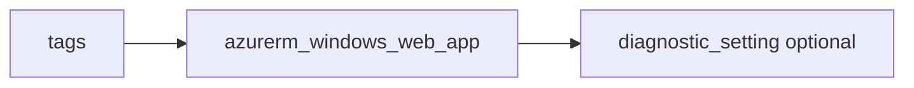

# Windows Web App

> Deploys `azurerm_windows_web_app` with HTTPS default and optional diagnostics.

## Overview

Use a Windows App Service plan (`os_type = Windows`). `name` must be globally unique.

## Architecture diagram



## Usage

```hcl
module "webwin" {
  source = "../../modules/app-services/windows-web-app"

  resource_group_name = module.rg.name
  location            = "uksouth"
  tags                = module.tags.tags
  name                = "mywinapp-${module.naming.unique_suffix}"
  service_plan_id     = module.plan_win.id
}
```

## Input variables

| Name | Type | Default | Required | Description |
|------|------|---------|----------|-------------|
| resource_group_name | string | — | yes | Resource group name |
| location | string | uksouth | no | Must be `uksouth` |
| tags | map(string) | — | yes | `_shared/tags` output |
| name | string | — | yes | App name |
| service_plan_id | string | — | yes | Windows plan ID |
| https_only | bool | true | no | HTTPS only |
| diagnostics_settings | object | null | no | Diagnostics to LAW |

## Outputs

| Name | Type | Description |
|------|------|-------------|
| id | string | Web app ID |
| name | string | App name |
| default_hostname | string | Default hostname |
| windows_web_app | object | Resource object |

## Policy compliance

- **Tags / location:** `uksouth` validation; `lifecycle { ignore_changes = [tags] }`.

## Versioning

Monorepo semver tags.

## Known limitations

- .NET version and app settings are configured outside this minimal wrapper.
