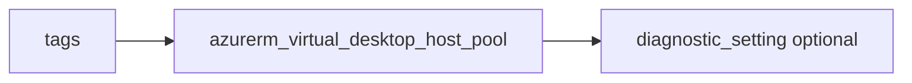

# Azure Virtual Desktop host pool

> Deploys `azurerm_virtual_desktop_host_pool` with optional diagnostics.

## Overview

Configure `host_pool_name`, `host_pool_type` (`Pooled` or `Personal`), and `load_balancer_type`. Use `validate_environment` for test pools as required by your rollout.

## Architecture diagram



## Usage

```hcl
module "avd" {
  source = "../../modules/compute/azure-virtual-desktop"

  resource_group_name = module.rg.name
  location            = "uksouth"
  tags                = module.tags.tags
  host_pool_name      = "pool-prod"
}
```

## Input variables

| Name | Type | Default | Required | Description |
|------|------|---------|----------|-------------|
| resource_group_name | string | — | yes | Resource group name |
| location | string | uksouth | no | Must be `uksouth` |
| tags | map(string) | — | yes | `_shared/tags` output |
| host_pool_name | string | — | yes | Host pool name |
| host_pool_type | string | Pooled | no | Pooled or Personal |
| load_balancer_type | string | BreadthFirst | no | Load balancing |
| validate_environment | bool | false | no | Validation host pool |
| diagnostics_settings | object | null | no | Diagnostics to LAW |

## Outputs

| Name | Type | Description |
|------|------|-------------|
| id | string | Host pool ID |
| name | string | Host pool name |
| host_pool | object | Resource object |

## Policy compliance

- **Tags / location:** `uksouth` validation; `lifecycle { ignore_changes = [tags] }`.

## Versioning

Monorepo semver tags.

## Known limitations

- Workspace, application groups, and session hosts are separate resources.
