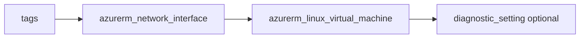

# Linux virtual machine

> Deploys `azurerm_network_interface` and `azurerm_linux_virtual_machine` with optional diagnostics.

## Overview

Provide `subnet_id`, `nic_name`, VM `name`, Linux `admin_username` and `admin_ssh_public_key`. Override `source_image` for a different SKU. `size` controls the VM SKU.

## Architecture diagram



## Usage

```hcl
module "vm" {
  source = "../../modules/compute/virtual-machine"

  resource_group_name = module.rg.name
  location            = "uksouth"
  tags                = module.tags.tags
  name                = "app01"
  nic_name            = "app01-nic"
  subnet_id           = module.snet.id
  admin_username      = "azureuser"
  admin_ssh_public_key = file("~/.ssh/id_rsa.pub")
}
```

## Input variables

| Name | Type | Default | Required | Description |
|------|------|---------|----------|-------------|
| resource_group_name | string | — | yes | Resource group name |
| location | string | uksouth | no | Must be `uksouth` |
| tags | map(string) | — | yes | `_shared/tags` output |
| name | string | — | yes | VM name |
| nic_name | string | — | yes | NIC name |
| subnet_id | string | — | yes | Subnet ID |
| size | string | Standard_B2s | no | VM size |
| admin_username | string | — | yes | Linux admin |
| admin_ssh_public_key | string | — | yes | SSH public key |
| os_disk_storage_account_type | string | Premium_LRS | no | OS disk type |
| source_image | object | Ubuntu 22.04 | no | Image reference |
| diagnostics_settings | object | null | no | Diagnostics to LAW |

## Outputs

| Name | Type | Description |
|------|------|-------------|
| id | string | VM ID |
| name | string | VM name |
| network_interface_id | string | NIC ID |
| virtual_machine | object | VM resource object |

## Policy compliance

- **Tags / location:** `uksouth` validation; `lifecycle { ignore_changes = [tags] }`.

## Versioning

Monorepo semver tags.

## Known limitations

- Data disks, extensions, and Azure AD SSH login are not included.
