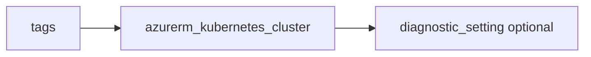

# AKS cluster

> Deploys `azurerm_kubernetes_cluster` with a system-assigned identity, default node pool, `network_profile`, and optional diagnostics. Exposes `kube_config_raw` (sensitive).

## Overview

Set `dns_prefix`, tune `node_count` and `vm_size`, and optionally `kubernetes_version`. `network_plugin` defaults to `azure`. Use outputs to configure CI/CD and kubectl; protect `kube_config_raw`.

## Architecture diagram



## Usage

```hcl
module "aks" {
  source = "../../modules/containers/aks-cluster"

  resource_group_name = module.rg.name
  location            = "uksouth"
  tags                = module.tags.tags
  name                = "aks-prod"
  dns_prefix          = "aksprod"
}
```

## Input variables

| Name | Type | Default | Required | Description |
|------|------|---------|----------|-------------|
| resource_group_name | string | — | yes | Resource group name |
| location | string | uksouth | no | Must be `uksouth` |
| tags | map(string) | — | yes | `_shared/tags` output |
| name | string | — | yes | Cluster name |
| dns_prefix | string | — | yes | API server DNS prefix |
| kubernetes_version | string | null | no | K8s version |
| node_count | number | 2 | no | Default pool count |
| vm_size | string | Standard_DS2_v2 | no | Node VM size |
| network_plugin | string | azure | no | azure or kubenet |
| diagnostics_settings | object | null | no | Diagnostics to LAW |

## Outputs

| Name | Type | Description |
|------|------|-------------|
| id | string | Cluster ID |
| name | string | Cluster name |
| kube_config_raw | string | Raw kubeconfig (sensitive) |
| aks_cluster | object | Cluster object |

## Policy compliance

- **Tags / location:** `uksouth` validation; `lifecycle { ignore_changes = [tags] }`.

## Versioning

Monorepo semver tags.

## Known limitations

- Additional node pools, AAD integration, and private clusters require extending the module.
