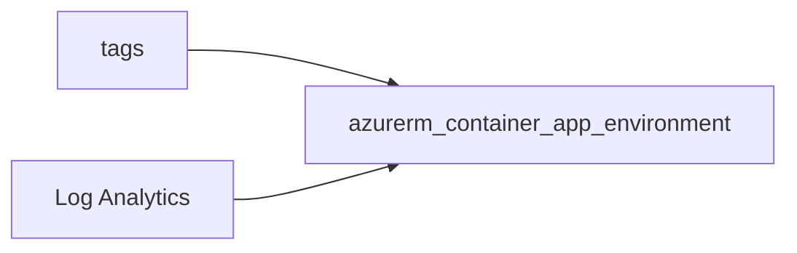

# Container Apps environment

> Deploys `azurerm_container_app_environment` with `log_analytics_workspace_id` for platform logs and optional extra diagnostics.

## Overview

Create Log Analytics first, then pass its ID. Container apps and jobs reference this environment’s resource ID.

## Architecture diagram



## Usage

```hcl
module "cae" {
  source = "../../modules/containers/container-app-environment"

  resource_group_name        = module.rg.name
  location                   = "uksouth"
  tags                       = module.tags.tags
  name                       = "cae-prod"
  log_analytics_workspace_id = module.law.id
}
```

## Input variables

| Name | Type | Default | Required | Description |
|------|------|---------|----------|-------------|
| resource_group_name | string | — | yes | Resource group name |
| location | string | uksouth | no | Must be `uksouth` |
| tags | map(string) | — | yes | `_shared/tags` output |
| name | string | — | yes | Environment name |
| log_analytics_workspace_id | string | — | yes | LAW resource ID |
| diagnostics_settings | object | null | no | Optional extra diagnostics |

## Outputs

| Name | Type | Description |
|------|------|-------------|
| id | string | Environment ID |
| name | string | Environment name |
| container_app_environment | object | Resource object |

## Policy compliance

- **Tags / location:** `uksouth` validation; `lifecycle { ignore_changes = [tags] }`.

## Versioning

Monorepo semver tags.

## Known limitations

- Custom VNet integration and workload profiles may require additional arguments.
