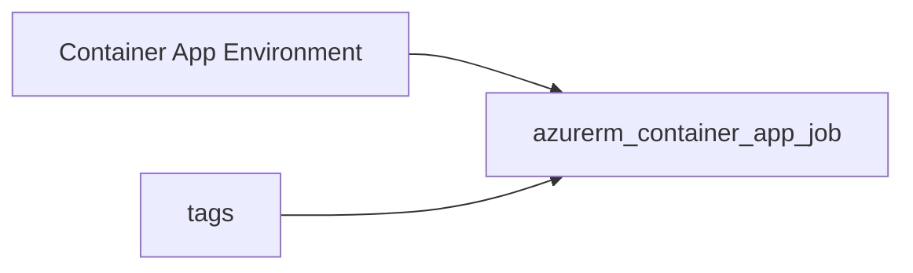

# Container app job

> Deploys `azurerm_container_app_job` with required container `cpu` and `memory`, either `manual_trigger_config` (default) or `schedule_trigger_config`, and optional diagnostics.

## Overview

Jobs run to completion (unlike long-running container apps). Use manual triggers for on-demand runs; set `schedule_trigger_config` with a `cron_expression` for recurring work. Event-driven (KEDA) triggers are not exposed in this module.

## Architecture diagram



## Usage

```hcl
module "caj" {
  source = "../../modules/containers/container-app-job"

  resource_group_name          = module.rg.name
  location                     = "uksouth"
  tags                         = module.tags.tags
  name                         = "batch-job"
  container_app_environment_id = module.cae.id
  container_name               = "worker"
  image                        = "mcr.microsoft.com/azuredocs/containerapps-helloworld:latest"
}
```

### Scheduled variant

```hcl
  schedule_trigger_config = {
    cron_expression = "0 2 * * *"
  }
```

## Input variables

| Name | Type | Default | Required | Description |
|------|------|---------|----------|-------------|
| resource_group_name | string | — | yes | Resource group name |
| location | string | uksouth | no | Must be `uksouth` |
| tags | map(string) | — | yes | `_shared/tags` output |
| name | string | — | yes | Job name |
| container_app_environment_id | string | — | yes | Environment resource ID |
| replica_timeout_in_seconds | number | 1800 | no | Replica timeout |
| replica_retry_limit | number | 1 | no | Retries per replica |
| container_name | string | — | yes | Container name |
| image | string | — | yes | Image reference |
| cpu | number | 0.25 | no | vCPU |
| memory | string | 0.5Gi | no | Memory |
| manual_trigger_config | object | {} | no | Parallelism settings when not scheduled |
| schedule_trigger_config | object | null | no | Cron schedule; when set, overrides manual |
| diagnostics_settings | object | null | no | Diagnostics to LAW |

## Outputs

| Name | Type | Description |
|------|------|-------------|
| id | string | Job resource ID |
| name | string | Job name |
| container_app_job | object | Resource object |

## Policy compliance

- **Tags / location:** `uksouth` validation; `lifecycle { ignore_changes = [tags] }`.

## Versioning

Monorepo semver tags.

## Known limitations

- Event-based KEDA triggers and registry auth blocks are not modeled; extend `main.tf` as needed.
