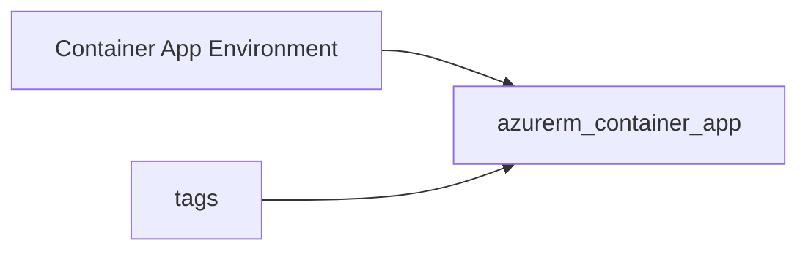

# Container app

> Deploys `azurerm_container_app` with a minimal `template` (single container), `revision_mode`, and optional diagnostics.

## Overview

Requires an existing Container Apps environment (`container_app_environment_id`). Set `container_name`, `image`, `cpu`, and `memory`. Extend the module for ingress, secrets, and scale rules.

## Architecture diagram



## Usage

```hcl
module "ca" {
  source = "../../modules/containers/container-app"

  resource_group_name          = module.rg.name
  location                     = "uksouth"
  tags                         = module.tags.tags
  name                         = "api"
  container_app_environment_id = module.cae.id
  container_name               = "api"
  image                        = "mcr.microsoft.com/azuredocs/containerapps-helloworld:latest"
}
```

## Input variables

| Name | Type | Default | Required | Description |
|------|------|---------|----------|-------------|
| resource_group_name | string | — | yes | Resource group name |
| location | string | uksouth | no | Must be `uksouth` |
| tags | map(string) | — | yes | `_shared/tags` output |
| name | string | — | yes | Container app name |
| container_app_environment_id | string | — | yes | Environment resource ID |
| revision_mode | string | Single | no | Single or Multiple |
| container_name | string | — | yes | Container name |
| image | string | — | yes | Image reference |
| cpu | number | 0.5 | no | CPU cores |
| memory | string | 1Gi | no | Memory |
| diagnostics_settings | object | null | no | Diagnostics to LAW |

## Outputs

| Name | Type | Description |
|------|------|-------------|
| id | string | Container app ID |
| name | string | App name |
| container_app | object | Resource object |

## Policy compliance

- **Tags / location:** `uksouth` validation; `lifecycle { ignore_changes = [tags] }`.

## Versioning

Monorepo semver tags.

## Known limitations

- Ingress, Dapr, and multi-container templates are not included in this minimal module.
