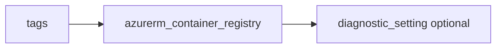

# Container registry

> Deploys `azurerm_container_registry` with optional diagnostics.

## Overview

`name` is globally unique and alphanumeric. Prefer `admin_enabled = false` and grant `AcrPull` via RBAC. Choose `sku` (`Basic`, `Standard`, `Premium`).

## Architecture diagram



## Usage

```hcl
module "acr" {
  source = "../../modules/containers/container-registry"

  resource_group_name = module.rg.name
  location            = "uksouth"
  tags                = module.tags.tags
  name                = module.naming.container_registry
}
```

## Input variables

| Name | Type | Default | Required | Description |
|------|------|---------|----------|-------------|
| resource_group_name | string | — | yes | Resource group name |
| location | string | uksouth | no | Must be `uksouth` |
| tags | map(string) | — | yes | `_shared/tags` output |
| name | string | — | yes | Globally unique ACR name |
| sku | string | Basic | no | SKU |
| admin_enabled | bool | false | no | Admin user |
| diagnostics_settings | object | null | no | Diagnostics to LAW |

## Outputs

| Name | Type | Description |
|------|------|-------------|
| id | string | Registry ID |
| name | string | Registry name |
| login_server | string | Login server URL |
| container_registry | object | Resource object |

## Policy compliance

- **Tags / location:** `uksouth` validation; `lifecycle { ignore_changes = [tags] }`.

## Versioning

Monorepo semver tags.

## Known limitations

- Geo-replication and private endpoints are composed in the root module.
