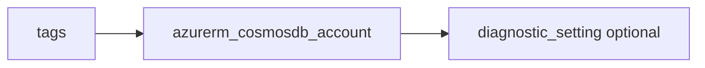

# Cosmos DB account

> Deploys `azurerm_cosmosdb_account` with a single `geo_location` block (failover priority 0) matching the enforced `uksouth` location, `consistency_policy`, optional free tier, and optional diagnostics.

## Overview

`name` must be globally unique and lowercase. `kind` defaults to `GlobalDocumentDB`. Consistency level is set via `consistency_level`.

## Architecture diagram



## Usage

```hcl
module "cosmos" {
  source = "../../modules/database/cosmosdb"

  resource_group_name = module.rg.name
  location            = "uksouth"
  tags                = module.tags.tags
  name                = module.naming.cosmosdb
}
```

## Input variables

| Name | Type | Default | Required | Description |
|------|------|---------|----------|-------------|
| resource_group_name | string | — | yes | Resource group name |
| location | string | uksouth | no | Must be `uksouth` |
| tags | map(string) | — | yes | `_shared/tags` output |
| name | string | — | yes | Account name |
| kind | string | GlobalDocumentDB | no | API kind |
| consistency_level | string | Session | no | Consistency level |
| enable_free_tier | bool | false | no | Free tier |
| diagnostics_settings | object | null | no | Diagnostics to LAW |

## Outputs

| Name | Type | Description |
|------|------|-------------|
| id | string | Account ID |
| name | string | Account name |
| endpoint | string | Cosmos endpoint |
| cosmosdb_account | object | Resource object |

## Policy compliance

- **Tags / location:** `uksouth` validation; `lifecycle { ignore_changes = [tags] }`.

## Versioning

Monorepo semver tags.

## Known limitations

- Additional regions, Cassandra/Mongo APIs, and private endpoints require extending the module or root module resources.
