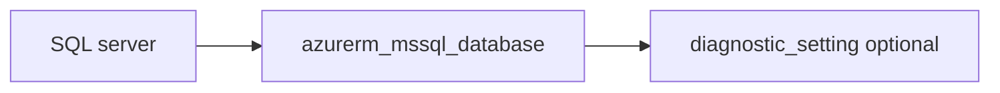

# Azure SQL database

> Deploys `azurerm_mssql_database` on an existing SQL server with optional diagnostics.

## Overview

Pass `server_id` from the `mssql-server` module. Configure `sku_name`, optional `collation`, and `max_size_gb`. Tags use `lifecycle { ignore_changes = [tags] }` for inherit-tags policy.

## Architecture diagram



## Usage

```hcl
module "sqldb" {
  source = "../../modules/database/mssql-database"

  server_id = module.sql.mssql_server.id
  tags      = module.tags.tags
  name      = "appdb"
  sku_name  = "S0"
}
```

## Input variables

| Name | Type | Default | Required | Description |
|------|------|---------|----------|-------------|
| server_id | string | — | yes | Azure SQL server resource ID |
| tags | map(string) | — | yes | `_shared/tags` output |
| name | string | — | yes | Database name |
| sku_name | string | — | yes | Database SKU |
| collation | string | null | no | Collation |
| max_size_gb | number | null | no | Max size GB |
| diagnostics_settings | object | null | no | Diagnostics to LAW |

## Outputs

| Name | Type | Description |
|------|------|-------------|
| id | string | Database ID |
| name | string | Database name |
| mssql_database | object | Resource object |

## Policy compliance

- **Tags:** `lifecycle { ignore_changes = [tags] }`.

## Versioning

Monorepo semver tags.

## Known limitations

- Geo-replication and long-term retention are not included.
