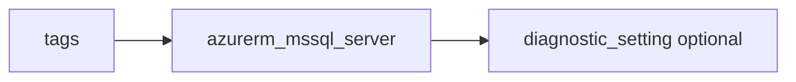

# Azure SQL server

> Deploys `azurerm_mssql_server` with optional Azure AD administrator and optional diagnostics.

## Overview

Use a globally unique DNS `name`. Store `administrator_login_password` securely (sensitive variable). Prefer `public_network_access_enabled = false` with private connectivity. Variable `sql_version` maps to the provider’s server version (not named `version`, which is reserved).

## Architecture diagram



## Usage

```hcl
module "sql" {
  source = "../../modules/database/mssql-server"

  resource_group_name          = module.rg.name
  location                     = "uksouth"
  tags                         = module.tags.tags
  name                         = module.naming.mssql_server
  administrator_login          = "sqladmin"
  administrator_login_password = var.sql_admin_password
}
```

## Input variables

| Name | Type | Default | Required | Description |
|------|------|---------|----------|-------------|
| resource_group_name | string | — | yes | Resource group name |
| location | string | uksouth | no | Must be `uksouth` |
| tags | map(string) | — | yes | `_shared/tags` output |
| name | string | — | yes | Server name (globally unique) |
| sql_version | string | 12.0 | no | SQL version string |
| administrator_login | string | — | yes | SQL admin login |
| administrator_login_password | string | — | yes | SQL admin password (sensitive) |
| minimum_tls_version | string | 1.2 | no | Minimum TLS |
| public_network_access_enabled | bool | false | no | Public access |
| azuread_administrator | object | null | no | Optional AAD admin |
| diagnostics_settings | object | null | no | Diagnostics to LAW |

## Outputs

| Name | Type | Description |
|------|------|-------------|
| id | string | Server ID |
| name | string | Server name |
| fqdn | string | Server FQDN |
| mssql_server | object | Resource object |

## Policy compliance

- **Tags / location:** `uksouth` validation; `lifecycle { ignore_changes = [tags] }`.

## Versioning

Monorepo semver tags.

## Known limitations

- Elastic pools, failover groups, and firewall rules are out of scope for this wrapper.
