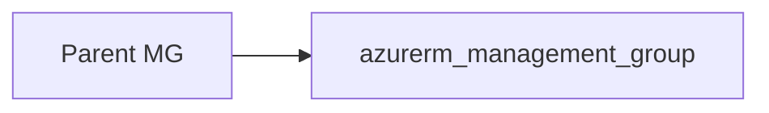

# Management group

> Deploys `azurerm_management_group` for tenant-level hierarchy. This resource has no Azure region or resource-group tags; it is not subject to the UK South location pattern.

## Overview

Use a short `name` (management group ID) and a human-readable `display_name`. Set `parent_management_group_id` to the parent group’s resource ID (often the tenant root). Optionally associate subscriptions with `subscription_ids`.

## Architecture diagram



## Usage

```hcl
module "mg" {
  source = "../../modules/governance/management-group"

  name                       = "platform"
  display_name               = "Platform"
  parent_management_group_id = data.azurerm_management_group.tenant_root.id
  subscription_ids           = []
}
```

## Input variables

| Name | Type | Default | Required | Description |
|------|------|---------|----------|-------------|
| name | string | — | yes | Management group ID |
| display_name | string | — | yes | Display name |
| parent_management_group_id | string | — | yes | Parent MG resource ID |
| subscription_ids | list(string) | [] | no | Subscriptions to associate |

## Outputs

| Name | Type | Description |
|------|------|-------------|
| id | string | Management group resource ID |
| name | string | Management group name |
| management_group | object | Resource object |

## Policy compliance

- **Tags / location:** Not applicable to this resource type in the same way as regional resources; no `lifecycle` tag ignore on this module.

## Versioning

Monorepo semver tags.

## Known limitations

- Hierarchy and subscription moves are governed by Azure RBAC and your organisation’s management group design.
