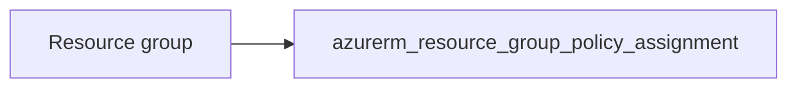

# Resource group policy assignment

> Deploys `azurerm_resource_group_policy_assignment` to attach a policy or initiative to a resource group. The assignment resource does not accept tags; `enforce` maps to the provider’s enforcement flag (azurerm 4.x).

## Overview

Pass `policy_definition_id` for a built-in or custom policy definition or policy set. Optional `parameters` as JSON string. Use `enforce = false` for audit-only behaviour where supported.

## Architecture diagram



## Usage

```hcl
module "pa" {
  source = "../../modules/governance/policy-assignment"

  name                   = "require-uk-south"
  resource_group_id      = module.rg.id
  policy_definition_id   = "/providers/Microsoft.Authorization/policyDefinitions/..."
  description            = "Align RG resources to UK South"
  enforce                = true
}
```

## Input variables

| Name | Type | Default | Required | Description |
|------|------|---------|----------|-------------|
| name | string | — | yes | Assignment name (max 64 chars) |
| resource_group_id | string | — | yes | Target resource group ID |
| policy_definition_id | string | — | yes | Policy or initiative resource ID |
| description | string | null | no | Description |
| parameters | string | null | no | JSON parameters |
| enforce | bool | true | no | Whether policy is enforced |

## Outputs

| Name | Type | Description |
|------|------|-------------|
| id | string | Policy assignment ID |
| name | string | Assignment name |
| policy_assignment | object | Resource object |

## Policy compliance

- **Tags:** Not applicable on this resource; assign policies that require tags on child resources as needed.

## Versioning

Monorepo semver tags.

## Known limitations

- Scope is resource group only; use other resources for subscription or MG scope if required.
