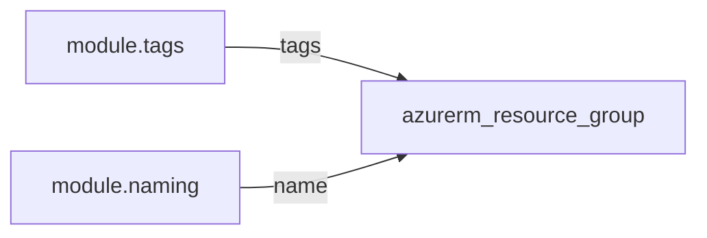

# Resource group

> Creates an Azure resource group with mandatory validated tags. This module is the **tag source** for the resource group and must not ignore tag changes.

## Overview

Use after `_shared/tags` and `_shared/naming` so the `name` and `tags` inputs are policy-compliant. The resource group is deployed to `uksouth` by default. Child resources should inherit tags via platform policy; resource modules use `lifecycle { ignore_changes = [tags] }` except here.

## Architecture diagram



## Prerequisites

- Contributor (or equivalent) on the subscription or resource group scope
- Tags from `_shared/tags`

## Usage

### Minimal example

```hcl
module "tags" {
  source = "../../modules/_shared/tags"
  # ...
}

module "naming" {
  source = "../../modules/_shared/naming"
  workload    = "demo"
  environment = "Development"
}

module "rg" {
  source = "../../modules/governance/resource-group"

  name     = module.naming.resource_group
  location = "uksouth"
  tags     = module.tags.tags
}
```

### Production example

```hcl
module "rg" {
  source = "../../modules/governance/resource-group"

  name     = module.naming.resource_group
  location = "uksouth"
  tags     = module.tags.tags
}
```

### Calling from ADO

```hcl
module "rg" {
  source = "git::https://dev.azure.com/{org}/{project}/_git/terraform-azure-modules//modules/governance/resource-group?ref=v0.1.0"

  name     = module.naming.resource_group
  location = "uksouth"
  tags     = module.tags.tags
}
```

## Input variables

| Name | Type | Default | Required | Description |
|------|------|---------|----------|-------------|
| name | string | — | yes | Resource group name (from naming module). |
| location | string | uksouth | no | Must be `uksouth`. |
| tags | map(string) | — | yes | Output of `_shared/tags` (all six mandatory tags). |

## Outputs

| Name | Type | Description |
|------|------|-------------|
| id | string | Resource ID of the resource group. |
| name | string | Resource group name. |
| resource_group | object | Resource group resource (non-sensitive). |

## Policy compliance

- **Required tags:** Satisfied by passing `_shared/tags` output.
- **Inherit tags:** Not applied on the RG itself; this resource holds the authoritative RG tags.
- **UK South:** `location` validation enforces `uksouth`.

## Resource naming

Uses the caller-provided `name`; typically `module.naming.resource_group` (`rg-{workload}-{env}-{instance}`).

## Versioning

Monorepo `vMAJOR.MINOR.PATCH` tags.

## Known limitations

- Does not configure management locks or RBAC; use separate modules or stack-level resources.
