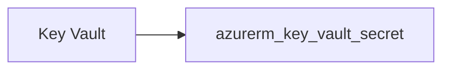

# Key Vault secret

> Creates `azurerm_key_vault_secret` for a secret value in an existing Key Vault.

## Overview

The secret `value` is sensitive. Ensure the deploying principal has RBAC on the vault (or legacy access policies if RBAC is disabled). This resource supports tags where the provider allows; `lifecycle { ignore_changes = [tags] }` accounts for tag inheritance policies.

## Architecture diagram



## Prerequisites

- Key Vault ID
- Permissions to set secrets on the vault

## Usage

```hcl
module "secret" {
  source = "../../modules/identity-security/key-vault-secret"

  key_vault_id = module.kv.id
  name         = "connection-string"
  value        = var.secret_value
  tags         = module.tags.tags
}
```

## Input variables

| Name | Type | Required | Description |
|------|------|----------|-------------|
| key_vault_id | string | yes | Key Vault resource ID |
| name | string | yes | Secret name |
| value | string (sensitive) | yes | Secret value |
| content_type | string | no | Optional MIME/content type |
| tags | map(string) | yes | `_shared/tags` output |

## Outputs

| Name | Description |
|------|-------------|
| id | Secret ID (versionless) |
| name | Secret name |
| version | Secret version |
| resource_id | Versioned resource ID |

## Policy compliance

- **Diagnostics:** Not applicable to secrets.
- **Tags:** Applied when supported; ignored after apply if policy modifies tags.

## Resource naming

Secret **name** must be unique within the vault.

## Versioning

Monorepo semver tags.

## Known limitations

- Secret values must not be committed; use CI secrets or Azure Key Vault references in downstream apps as appropriate.
