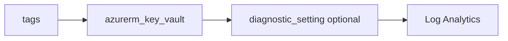

# Key Vault

> Deploys `azurerm_key_vault` with RBAC-based data plane access by default, optional network ACLs, and optional diagnostics to Log Analytics.

## Overview

Use names from `_shared/naming` (`key_vault` output) to stay within global uniqueness and length limits. Pass `tenant_id` from your root module (for example `data.azurerm_client_config.current.tenant_id`). With `rbac_authorization_enabled = true`, grant data-plane access with the `role-assignment` module (e.g. Key Vault Secrets Officer) to managed identities or deployment principals.

## Architecture diagram



## Prerequisites

- Unique `name` (globally)
- `Microsoft.KeyVault` registered
- Caller identity able to create Key Vaults in the subscription

## Usage

### Minimal example

```hcl
module "kv" {
  source = "../../modules/identity-security/key-vault"

  resource_group_name = module.rg.name
  location            = "uksouth"
  tags                = module.tags.tags
  name                = module.naming.key_vault
  tenant_id           = data.azurerm_client_config.current.tenant_id
}
```

### Calling from ADO

```hcl
module "kv" {
  source = "git::https://dev.azure.com/{org}/{project}/_git/terraform-azure-modules//modules/identity-security/key-vault?ref=v0.2.0"
  # ...
}
```

## Input variables

| Name | Type | Default | Required | Description |
|------|------|---------|----------|-------------|
| resource_group_name | string | — | yes | Resource group name |
| location | string | uksouth | no | Must be `uksouth` |
| tags | map(string) | — | yes | `_shared/tags` output |
| name | string | — | yes | Vault name |
| tenant_id | string | — | yes | AAD tenant ID |
| sku_name | string | standard | no | `standard` or `premium` |
| rbac_authorization_enabled | bool | true | no | RBAC vs access policies |
| purge_protection_enabled | bool | false | no | Purge protection |
| soft_delete_retention_days | number | 90 | no | 7–90 |
| public_network_access_enabled | bool | true | no | Public network access |
| network_acls | object | null | no | Network ACL block |
| diagnostics_settings | object | null | no | Diagnostics to LAW |

## Outputs

| Name | Type | Description |
|------|------|-------------|
| id | string | Key Vault resource ID |
| name | string | Vault name |
| vault_uri | string | Vault URI |
| key_vault | object | Resource object |

## Policy compliance

- **Tags / location:** Validated `uksouth`; `lifecycle { ignore_changes = [tags] }` for inherit-tags policy.
- **Required tags:** Via `var.tags` from `_shared/tags`.

## Resource naming

Globally unique; max 24 characters. Use `_shared/naming` output `key_vault`.

## Versioning

Monorepo semver tags.

## Known limitations

- Soft-delete and purge behaviour interacts with provider `features` blocks in the root module; align destroy workflows with your platform standards.
