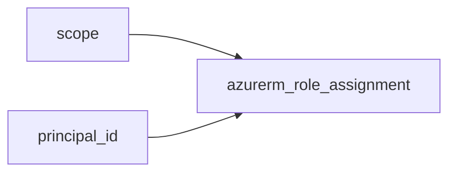

# Role assignment

> Creates `azurerm_role_assignment` at subscription, resource group, or resource scope.

## Overview

Provide **exactly one** of `role_definition_name` (e.g. `Reader`) or `role_definition_id` (full ARM ID). This resource has **no** Azure tags or location; compliance is inherited from the `scope` resource.

## Architecture diagram



## Usage

```hcl
module "ra" {
  source = "../../modules/identity-security/role-assignment"

  scope                = module.rg.id
  principal_id         = azurerm_user_assigned_identity.app.principal_id
  role_definition_name = "Contributor"
}
```

## Input variables

| Name | Type | Required | Description |
|------|------|----------|-------------|
| scope | string | yes | Assignment scope ARM ID |
| principal_id | string | yes | Object ID of assignee |
| role_definition_name | string | one of | Built-in or custom role name |
| role_definition_id | string | one of | Full role definition resource ID |
| description | string | no | Optional description |

## Outputs

| Name | Description |
|------|-------------|
| id | Role assignment ID |
| name | Assignment name (UUID) |
| principal_id | Principal ID |
| role_assignment | Resource object |

## Policy compliance

- **Tags / location:** Not supported on role assignments.
- **UK South:** Enforced by resources inside `scope` when applicable.

## Versioning

Monorepo semver tags.

## Known limitations

- Name collisions can occur if the same role is assigned twice at the same scope; Terraform addresses by stable resource addressing.
