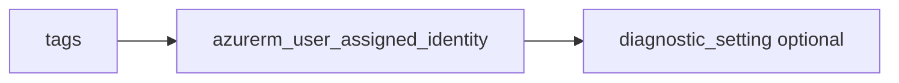

# User-assigned managed identity

> Deploys `azurerm_user_assigned_identity` with optional diagnostics where supported.

## Overview

Create a user-assigned identity in a resource group, then grant RBAC with the `role-assignment` module using `principal_id` from outputs.

## Architecture diagram



## Usage

```hcl
module "uai" {
  source = "../../modules/identity-security/user-assigned-identity"

  resource_group_name = module.rg.name
  location            = "uksouth"
  tags                = module.tags.tags
  name                = "app-identity"
}
```

## Input variables

| Name | Type | Default | Required | Description |
|------|------|---------|----------|-------------|
| resource_group_name | string | — | yes | Resource group name |
| location | string | uksouth | no | Must be `uksouth` |
| tags | map(string) | — | yes | `_shared/tags` output |
| name | string | — | yes | Identity name |
| diagnostics_settings | object | null | no | Diagnostics to LAW |

## Outputs

| Name | Type | Description |
|------|------|-------------|
| id | string | Identity resource ID |
| name | string | Identity name |
| principal_id | string | Object ID for RBAC |
| client_id | string | Client ID for apps |
| user_assigned_identity | object | Resource object |

## Policy compliance

- **Tags / location:** `uksouth` validation; `lifecycle { ignore_changes = [tags] }`.

## Versioning

Monorepo semver tags.

## Known limitations

- Federated credentials for workload identity are not included here.
