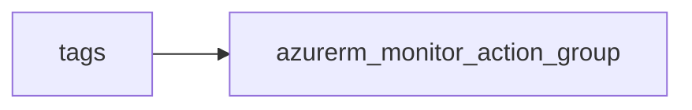

# Monitor action group

> Deploys `azurerm_monitor_action_group` with at least one email receiver (required by module validation) and optional webhooks.

## Overview

Action groups are regional-agnostic in terms of naming but live in a resource group. Use a short `short_name` (≤12 characters). Add `webhook_receivers` for automation or ITSM integration.

## Architecture diagram



## Usage

```hcl
module "ag" {
  source = "../../modules/monitoring/action-group"

  resource_group_name = module.rg.name
  tags                = module.tags.tags
  name                = "platform-critical"
  short_name          = "plat-crit"
  email_receivers = [
    { name = "ops", email_address = "ops@example.com" }
  ]
}
```

## Input variables

| Name | Type | Default | Required | Description |
|------|------|---------|----------|-------------|
| resource_group_name | string | — | yes | Resource group name |
| tags | map(string) | — | yes | `_shared/tags` output |
| name | string | — | yes | Action group name |
| short_name | string | — | yes | Short name (≤12 chars) |
| email_receivers | list(object) | — | yes | At least one entry |
| webhook_receivers | list(object) | [] | no | Optional webhooks |

## Outputs

| Name | Type | Description |
|------|------|-------------|
| id | string | Action group ID |
| name | string | Name |
| action_group | object | Resource object |

## Policy compliance

- **Tags:** `lifecycle { ignore_changes = [tags] }` where applied.

## Versioning

Monorepo semver tags.

## Known limitations

- SMS, voice, and other receiver types are not exposed in this module; extend `main.tf` if needed.
