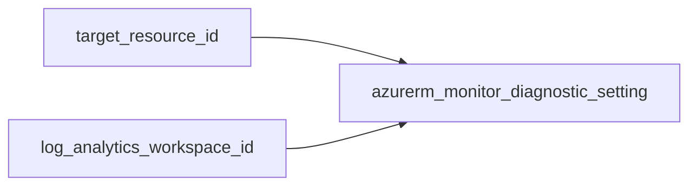

# Monitor diagnostic setting

> Thin wrapper around `azurerm_monitor_diagnostic_setting` to send logs and metrics from any supported Azure resource to a Log Analytics workspace.

## Overview

`azurerm_monitor_diagnostic_setting` does **not** support Azure resource tags or a `location`; compliance for tagging is inherited from the **target** resource and your organisation’s Log Analytics policies. This module enables log category groups (default `allLogs`) and optionally `AllMetrics`.

## Architecture diagram



## Prerequisites

- Target resource must support diagnostic settings
- Destination Log Analytics workspace ID

## Usage

### Minimal example

```hcl
module "diagnostics" {
  source = "../../modules/monitoring/diagnostic-setting"

  name                       = "app-to-law"
  target_resource_id         = azurerm_linux_web_app.example.id
  log_analytics_workspace_id = module.log_analytics.id
}
```

### Production example

```hcl
module "diagnostics" {
  source = "../../modules/monitoring/diagnostic-setting"

  name                       = "${var.workload}-diag-law"
  target_resource_id         = module.web_app.id
  log_analytics_workspace_id = module.log_analytics.id
  log_category_groups        = ["allLogs"]
  enable_metrics             = true
}
```

### Calling from ADO

```hcl
module "diagnostics" {
  source = "git::https://dev.azure.com/{org}/{project}/_git/terraform-azure-modules//modules/monitoring/diagnostic-setting?ref=v0.1.0"

  name                       = var.diagnostic_name
  target_resource_id         = var.target_resource_id
  log_analytics_workspace_id = var.log_analytics_workspace_id
}
```

## Input variables

| Name | Type | Default | Required | Description |
|------|------|---------|----------|-------------|
| name | string | — | yes | Diagnostic setting name. |
| target_resource_id | string | — | yes | ID of the monitored resource. |
| log_analytics_workspace_id | string | — | yes | Destination Log Analytics workspace resource ID. |
| log_category_groups | list(string) | ["allLogs"] | no | Category groups to enable. |
| enable_metrics | bool | true | no | Enable AllMetrics when true. |

## Outputs

| Name | Type | Description |
|------|------|-------------|
| id | string | Diagnostic setting ID. |
| name | string | Diagnostic setting name. |

## Policy compliance

- **Tags / location:** Not applicable; resource does not support tags.
- **UK South:** Destination resources should still be deployed per policy; diagnostics follow the monitored resource.

## Resource naming

Choose a stable `name` per target + destination pair; Azure requires unique diagnostic setting names per target resource.

## Versioning

Monorepo semver tags.

## Known limitations

- Some resource types expose specific log categories only; adjust `log_category_groups` if `allLogs` is not supported for a given service.
