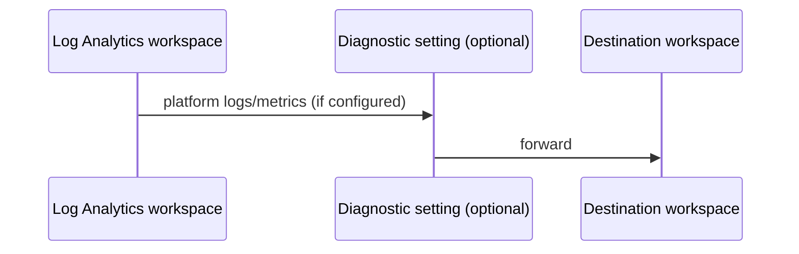

# Log Analytics workspace

> Deploys a Log Analytics workspace in a resource group with validated tags and optional diagnostic forwarding to another workspace.

## Overview

Centralises operational logs and metrics for a landing zone or workload. Tags are required from `_shared/tags`. Default SKU and retention suit general platform logging; adjust as needed. An optional `diagnostics_settings` object can forward this workspace’s platform logs to a **different** Log Analytics workspace (for example central Sentinel); leave `null` to avoid circular forwarding to itself.

## Architecture diagram



## Prerequisites

- Resource group must exist
- `Microsoft.OperationalInsights` resource provider registered

## Usage

### Minimal example

```hcl
module "log_analytics" {
  source = "../../modules/monitoring/log-analytics-workspace"

  resource_group_name = module.rg.name
  location            = "uksouth"
  tags                = module.tags.tags
  name                = module.naming.log_analytics
}
```

### Production example

```hcl
module "log_analytics" {
  source = "../../modules/monitoring/log-analytics-workspace"

  resource_group_name = module.rg.name
  location            = "uksouth"
  tags                = module.tags.tags
  name                = module.naming.log_analytics
  sku                 = "PerGB2018"
  retention_in_days   = 90
  diagnostics_settings = null
}
```

### Calling from ADO

```hcl
module "log_analytics" {
  source = "git::https://dev.azure.com/{org}/{project}/_git/terraform-azure-modules//modules/monitoring/log-analytics-workspace?ref=v0.1.0"

  resource_group_name = module.rg.name
  location            = "uksouth"
  tags                = module.tags.tags
  name                = module.naming.log_analytics
}
```

## Input variables

| Name | Type | Default | Required | Description |
|------|------|---------|----------|-------------|
| resource_group_name | string | — | yes | Existing resource group name. |
| location | string | uksouth | no | Must be `uksouth`. |
| tags | map(string) | — | yes | `_shared/tags` output. |
| name | string | — | yes | Workspace name. |
| sku | string | PerGB2018 | no | Workspace SKU. |
| retention_in_days | number | 30 | no | Log retention. |
| diagnostics_settings | object | null | no | Optional forwarding to another workspace (`log_analytics_workspace_id`, optional `name`, `logs_enabled`, `metrics_enabled`). |

## Outputs

| Name | Type | Description |
|------|------|-------------|
| id | string | Workspace Azure resource ID. |
| name | string | Workspace name. |
| workspace_id | string | Customer / workspace GUID for agents. |
| log_analytics_workspace | object | Workspace resource object. |

## Policy compliance

- **Tags:** Required via `_shared/tags`; `lifecycle { ignore_changes = [tags] }` accounts for inherit-tags policy on the workspace resource.
- **UK South:** `location` locked to `uksouth`.

## Resource naming

Pass a name from `_shared/naming` (`log-{workload}-{env}-{instance}`) or an organisation-approved pattern.

## Versioning

Monorepo semver tags.

## Known limitations

- Forwarding diagnostics from a workspace to itself is not supported; use `diagnostics_settings = null` unless a separate destination workspace ID is provided.
