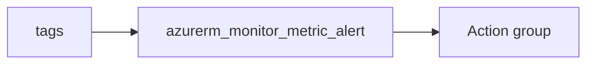

# Metric alert

> Deploys `azurerm_monitor_metric_alert` with a single criteria block and one action pointing at an action group.

## Overview

Set `scopes` to the resource IDs to monitor, then configure `metric_namespace`, `metric_name`, `aggregation`, `operator`, and `threshold`. Tune `frequency` and `window_size` as ISO8601 durations.

## Architecture diagram



## Usage

```hcl
module "alert" {
  source = "../../modules/monitoring/monitor-alert"

  resource_group_name = module.rg.name
  tags                = module.tags.tags
  name                = "storage-capacity"
  scopes              = [module.sa.id]
  metric_namespace    = "Microsoft.Storage/storageAccounts"
  metric_name         = "UsedCapacity"
  aggregation         = "Average"
  operator            = "GreaterThan"
  threshold           = 10737418240
  action_group_id     = module.ag.id
}
```

## Input variables

| Name | Type | Default | Required | Description |
|------|------|---------|----------|-------------|
| resource_group_name | string | — | yes | Resource group for the alert rule |
| tags | map(string) | — | yes | `_shared/tags` output |
| name | string | — | yes | Alert name |
| scopes | list(string) | — | yes | Monitored resource IDs |
| enabled | bool | true | no | Alert enabled |
| severity | number | 2 | no | 0–4 |
| frequency | string | PT1M | no | Evaluation frequency |
| window_size | string | PT5M | no | Aggregation window |
| metric_namespace | string | — | yes | Metric namespace |
| metric_name | string | — | yes | Metric name |
| aggregation | string | — | yes | Aggregation type |
| operator | string | — | yes | Comparison operator |
| threshold | number | — | yes | Threshold |
| action_group_id | string | — | yes | Action group resource ID |

## Outputs

| Name | Type | Description |
|------|------|-------------|
| id | string | Alert ID |
| name | string | Alert name |
| metric_alert | object | Resource object |

## Policy compliance

- **Tags:** `lifecycle { ignore_changes = [tags] }`.

## Versioning

Monorepo semver tags.

## Known limitations

- Multi-criteria and dynamic thresholds are not modeled; extend the module for advanced scenarios.
