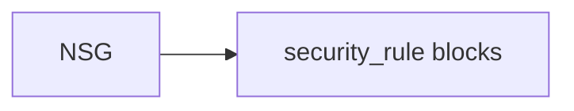

# Network security group

> Deploys `azurerm_network_security_group` with dynamic inline `security_rule` blocks.

## Overview

Define rules as a list of objects; use either single prefix/port fields or plural list fields per Azure constraints (do not mix incorrectly or the plan may fail). Tags use lifecycle ignore for inherit-tags policy.

## Architecture diagram



## Usage

```hcl
module "nsg" {
  source = "../../modules/networking/network-security-group"

  resource_group_name = module.rg.name
  location            = "uksouth"
  tags                = module.tags.tags
  name                = module.naming.nsg
  security_rules = [
    {
      name                       = "AllowHttpsIn"
      priority                   = 100
      direction                  = "Inbound"
      access                     = "Allow"
      protocol                   = "Tcp"
      source_port_range          = "*"
      destination_port_range       = "443"
      source_address_prefix      = "*"
      destination_address_prefix = "*"
    }
  ]
}
```

## Policy compliance

- **UK South / tags:** Standard validation and `lifecycle { ignore_changes = [tags] }`.

## Versioning

Monorepo semver tags.

## Known limitations

- Complex NSGs are often split into separate rule resources for readability; this module keeps rules inline for smaller footprints.
