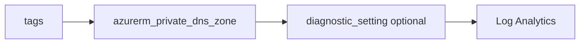

# Private DNS zone

> Deploys `azurerm_private_dns_zone`. Private DNS zones are global; there is no regional `location` on this resource. Optional SOA override and optional diagnostics.

## Overview

Create a zone such as `privatelink.blob.core.windows.net` or a custom private zone in a resource group. Link the zone to virtual networks separately (not included in this module). Pass standard tags for stack consistency.

## Architecture diagram



## Usage

```hcl
module "pdns" {
  source = "../../modules/networking/private-dns-zone"

  resource_group_name = module.rg.name
  tags                = module.tags.tags
  name                = "privatelink.blob.core.windows.net"
}
```

## Input variables

| Name | Type | Default | Required | Description |
|------|------|---------|----------|-------------|
| resource_group_name | string | — | yes | Resource group for the zone |
| tags | map(string) | — | yes | `_shared/tags` output |
| name | string | — | yes | DNS zone name |
| soa_record | object | null | no | Optional SOA block |
| diagnostics_settings | object | null | no | Diagnostics to LAW |

## Outputs

| Name | Type | Description |
|------|------|-------------|
| id | string | Zone resource ID |
| name | string | Zone name |
| private_dns_zone | object | Resource object |

## Policy compliance

- **Tags:** `lifecycle { ignore_changes = [tags] }` where applied on the resource.

## Versioning

Monorepo semver tags.

## Known limitations

- VNet links and A records are typically separate resources or root-module calls.
