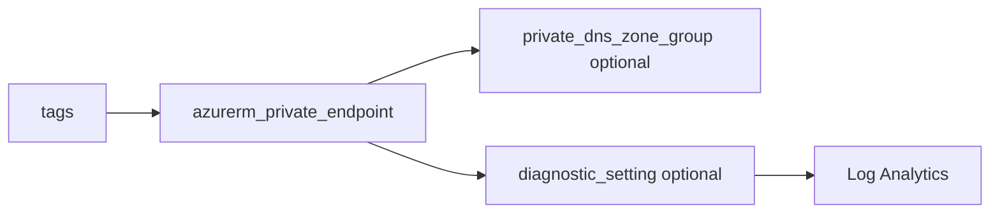

# Private endpoint

> Deploys `azurerm_private_endpoint` with optional private DNS zone group and optional diagnostics to Log Analytics.

## Overview

Place the endpoint in a subnet via `subnet_id`, target a service with `private_connection_resource_id` and `subresource_names`, and name the private service connection with `private_connection_name`. Align with `_shared/naming` and `_shared/tags`.

## Architecture diagram



## Usage

```hcl
module "pe" {
  source = "../../modules/networking/private-endpoint"

  resource_group_name          = module.rg.name
  location                     = "uksouth"
  tags                         = module.tags.tags
  name                         = module.naming.private_endpoint
  subnet_id                    = module.snet.id
  private_connection_resource_id = module.storage.id
  subresource_names            = ["blob"]
  private_connection_name      = "pe-blob"
  private_dns_zone_group = {
    name                 = "default"
    private_dns_zone_ids = [module.pdns_blob.id]
  }
}
```

## Input variables

| Name | Type | Default | Required | Description |
|------|------|---------|----------|-------------|
| resource_group_name | string | — | yes | Resource group name |
| location | string | uksouth | no | Must be `uksouth` |
| tags | map(string) | — | yes | `_shared/tags` output |
| name | string | — | yes | Private endpoint name |
| subnet_id | string | — | yes | Subnet for the NIC |
| private_connection_resource_id | string | — | yes | Target Azure resource ID |
| subresource_names | list(string) | — | yes | Private link subresources |
| is_manual_connection | bool | false | no | Manual approval flow |
| private_connection_name | string | — | yes | Private service connection name |
| request_message | string | null | no | Manual connection message |
| private_dns_zone_group | object | null | no | Optional DNS zone group |
| diagnostics_settings | object | null | no | Diagnostics to LAW |

## Outputs

| Name | Type | Description |
|------|------|-------------|
| id | string | Private endpoint ID |
| name | string | Name |
| private_endpoint | object | Resource object |

## Policy compliance

- **Tags / location:** `uksouth` validation; `lifecycle { ignore_changes = [tags] }` for inherit-tags policy.

## Versioning

Monorepo semver tags.

## Known limitations

- Manual connections require approval workflow outside this module.
