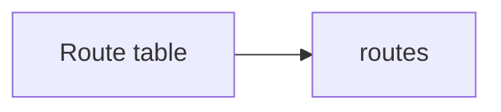

# Route table

> Deploys `azurerm_route_table` with optional user-defined routes and diagnostics.

## Overview

Set `bgp_route_propagation_enabled` to control BGP route propagation to associated subnets. Associate the route table to subnets with `azurerm_subnet_route_table_association` in the calling configuration.

## Architecture diagram



## Usage

```hcl
module "rt" {
  source = "../../modules/networking/route-table"

  resource_group_name = module.rg.name
  location            = "uksouth"
  tags                = module.tags.tags
  name                = module.naming.route_table
  routes = [
    {
      name           = "to-firewall"
      address_prefix = "0.0.0.0/0"
      next_hop_type  = "VirtualAppliance"
      next_hop_in_ip_address = "10.60.2.4"
    }
  ]
}
```

## Input variables

| Name | Type | Default | Description |
|------|------|---------|-------------|
| bgp_route_propagation_enabled | bool | true | BGP propagation |
| routes | list(object) | [] | UDR definitions |

## Policy compliance

- **UK South / tags:** Standard validation and tag lifecycle ignore.

## Resource naming

Typically `rt-{workload}-{env}-{instance}` from `_shared/naming`.

## Versioning

Monorepo semver tags.

## Known limitations

- Route table association to subnet is not included; declare it next to your subnet module calls.
