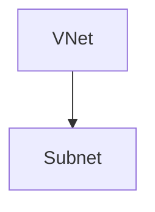

# Subnet

> Deploys `azurerm_subnet` with optional delegations, service endpoints, and diagnostics.

## Overview

`azurerm_subnet` does **not** support resource tags in the AzureRM provider; callers must still pass `var.tags` for consistency with other modules (used for documentation and stack patterns). Policy inheritance applies via the resource group and virtual network. Associate an NSG using `azurerm_subnet_network_security_group_association` in the root module or a composition module.

## Architecture diagram



## Usage

```hcl
module "subnet" {
  source = "../../modules/networking/subnet"

  resource_group_name  = module.rg.name
  location             = "uksouth"
  tags                 = module.tags.tags
  name                 = module.naming.subnet
  virtual_network_name = module.vnet.name
  address_prefixes     = ["10.60.1.0/24"]
}
```

## Input variables

See `variables.tf` for `service_endpoints`, `delegations`, `private_endpoint_network_policies`, and `diagnostics_settings`.

## Policy compliance

- **Tags:** Required input for module contract; not applied on subnet resource (provider limitation).
- **UK South:** `location` validates `uksouth` for alignment with regional policy.

## Resource naming

Typically `snet-{workload}-{env}-{instance}` from `_shared/naming`.

## Versioning

Monorepo semver tags.

## Known limitations

- Subnet policy features vary by API version; validate delegations for your target PaaS (AKS, App Service, etc.).
