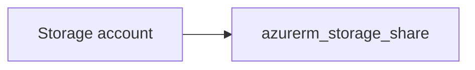

# Storage file share

> Deploys `azurerm_storage_share` against an existing storage account using `storage_account_id`. The share resource does not support Azure resource tags; `tags` is kept as a required input for stack consistency with other modules.

## Overview

Reference the parent storage account by ID (not resource group name). Set `quota` in GB and `enabled_protocol` (`SMB` or `NFS`).

## Architecture diagram



## Usage

```hcl
module "share" {
  source = "../../modules/storage/file-share"

  storage_account_id = module.sa.storage_account.id
  tags               = module.tags.tags
  name               = "data"
  quota              = 100
}
```

## Input variables

| Name | Type | Default | Required | Description |
|------|------|---------|----------|-------------|
| storage_account_id | string | — | yes | Storage account resource ID |
| tags | map(string) | — | yes | Tags for contract alignment |
| name | string | — | yes | Share name |
| quota | number | 100 | no | Size in GB |
| enabled_protocol | string | SMB | no | SMB or NFS |

## Outputs

| Name | Type | Description |
|------|------|-------------|
| id | string | Share ID |
| name | string | Share name |
| storage_share | object | Resource object |

## Policy compliance

- **Tags:** Not applied to `azurerm_storage_share`; use tags on the storage account via `storage-account` module.

## Versioning

Monorepo semver tags.

## Known limitations

- NFS shares require a suitable storage account configuration and network setup.
