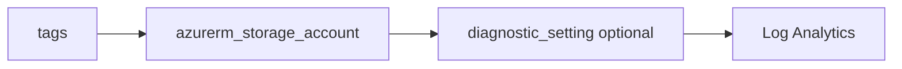

# Storage account

> Deploys `azurerm_storage_account` with TLS and HTTPS-oriented defaults and optional diagnostics to Log Analytics.

## Overview

Use a globally unique lowercase `name`. Tune `account_tier`, `account_replication_type`, and `account_kind` for your workload. Prefer `https_traffic_only_enabled = true` and `min_tls_version = TLS1_2` (defaults).

## Architecture diagram



## Usage

```hcl
module "sa" {
  source = "../../modules/storage/storage-account"

  resource_group_name = module.rg.name
  location            = "uksouth"
  tags                = module.tags.tags
  name                = module.naming.storage_account
}
```

## Input variables

| Name | Type | Default | Required | Description |
|------|------|---------|----------|-------------|
| resource_group_name | string | — | yes | Resource group name |
| location | string | uksouth | no | Must be `uksouth` |
| tags | map(string) | — | yes | `_shared/tags` output |
| name | string | — | yes | Globally unique account name |
| account_tier | string | Standard | no | Standard or Premium |
| account_replication_type | string | LRS | no | e.g. LRS, GRS, ZRS |
| account_kind | string | StorageV2 | no | Account kind |
| min_tls_version | string | TLS1_2 | no | Minimum TLS |
| https_traffic_only_enabled | bool | true | no | HTTPS only |
| allow_nested_items_to_be_public | bool | false | no | Public blobs |
| diagnostics_settings | object | null | no | Diagnostics to LAW |

## Outputs

| Name | Type | Description |
|------|------|-------------|
| id | string | Storage account ID |
| name | string | Account name |
| primary_blob_endpoint | string | Blob endpoint URL |
| storage_account | object | Resource object |

## Policy compliance

- **Tags / location:** `uksouth` validation; `lifecycle { ignore_changes = [tags] }`.

## Versioning

Monorepo semver tags.

## Known limitations

- Network rules and private endpoints are usually composed in the root module alongside this module.
